# kttkpm-lab-6-docker
- [PART 1](#PART-1)
- [PART 2](#PART-2)

## **PART 1**
1. `docker --version`: Hiển thị version của docker trên thiết bị

2. `docker run hello-world`: Docker chạy image hello-world - image build sẵn của docker, nếu chưa có thì docker sẽ pull từ thư viện về 
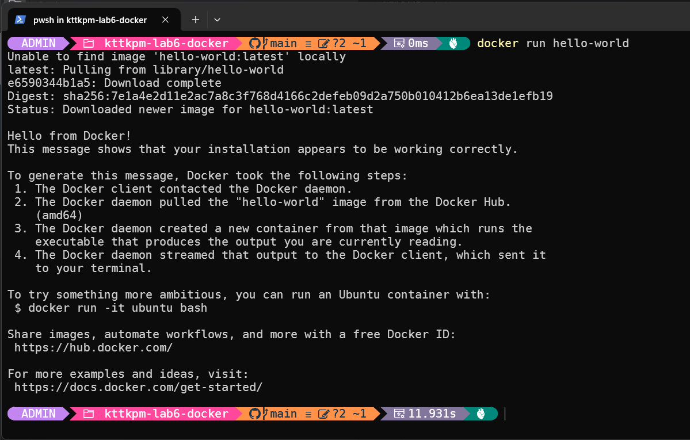
3. `docker pull nginx`: pull image nginx về local

4. `docker images`: Hiển thị tất cả các images đang có

5. `docker run -d nginx`: Chạy image nginx với flag `-d` hay `--detach` để chạy ngầm image nginx

6. `docker ps`: List các containers

7. `docker ps -a`: List tất cả containers bao gồm các containers đã exited

8. `docker logs <container_id>`: hiển thị logs của container chỉ định (f80:nginx)

9. `docker exec -it <container_id> /bin/sh`: thực thi lệnh đối với container đang chạy. Ở đây chạy /bin/sh tức truy cập vào shell của container

10. `docker stop <container_id>`: Dừng container đang chạy

11. `docker restart <container_id>`: Khởi dđộng lại container

12. `docker rm <container_id>`: Xóa container với container id

13. `docker container prune`: Xóa tất cả các containers đang stop

14. `docker rmi <image_id>`: xóa Image với image id

15. `docker image prune -a`: Xoá tất cả image không hoạt động

16. `docker run -d -p 8080:80 nginx`: khởi chaạy nginx với flag `-p` để map port <local port:docker container port>, tức map port 8080 ở máy local đến port 80 của host đang chạy nginx
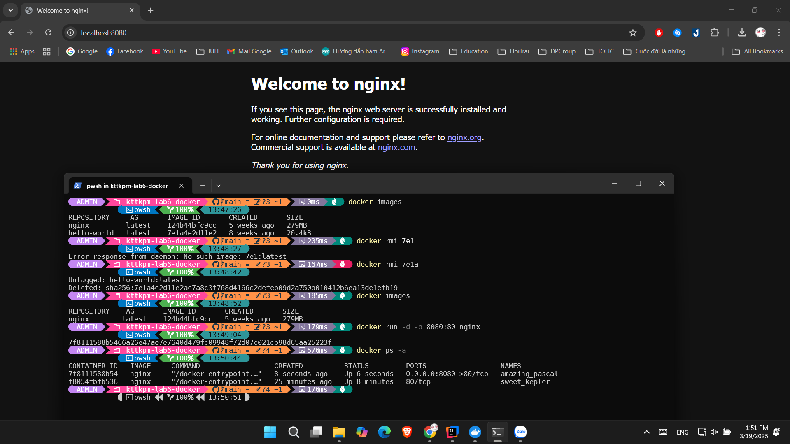
17. `docker inspect <container_id>`: Cung cấp thông tin chi tiết về cấu trúc container được kiểm soát bởi Docker thể hiện dưới JSON format. Gồm một số thông tin như: port binding, volume size, network, ip, state,...

18. `docker run -d -v mydata:/data nginx`: Chạy con nginx gắn volume tên mydata vào đường dẫn /data trong container. Nếu mydata chưa có sẽ tự tạo. Dữ liệu trong data sẽ lưu vào mydata nếu có xóa container đi thì vẫn không mất dữ liệu

19. `docker volume ls`: list các volume

20. `docker volume prune`: xóa tất cả các volume không được sử dụng bởi container nào

21. `docker -d --name my_nginx nginx`: Chạy con nginx và flag `--name` đăt tên cho container đó là my_nginx

22. `docker stats`: hiển thị trực tiếp resources mà container sử dụng như Task manager trên Windows hay `htop` trên linux

23. `docker network ls`: liệt kê các network có trong docker. Caác cột: Network ID, Name, Driver, Scope. Network ID: id của mạng; Name: tên của network; Driver: loại driver dđể quản lý network gồm: Brigde, Host, None; Scope: Phạm vi của network

24. `docker network create my_network`: tạo network mới có tên là my_network

25. `docker run -d --network my_network --name my_container nginx`: Chạy con nginx với network là my_network và container tên my_container

26. `docker network connect my_network my_nginx`: Kết nóối container vào 1 network. Keết nối container my_nginx vào network my_network
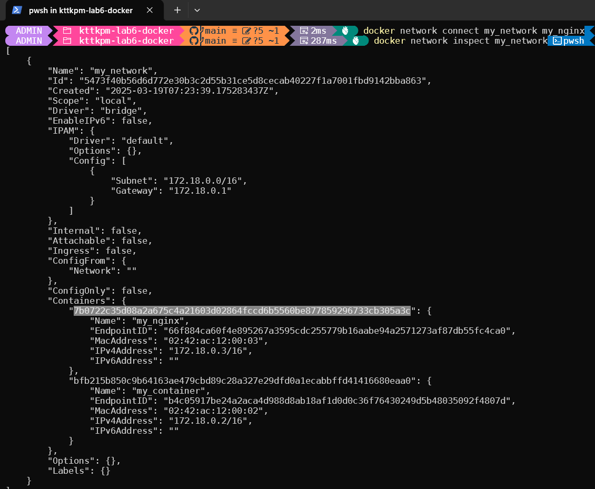
27. `docker run -d -e MY_ENV=hello_world nginx`: Chạy con nginx vóới thiết lập biến môi trường MY_ENV là Hello world

28. `docker logs -f my_nginx`: mở log của container teên my_nginx. Flag `-f` mở theo real-times
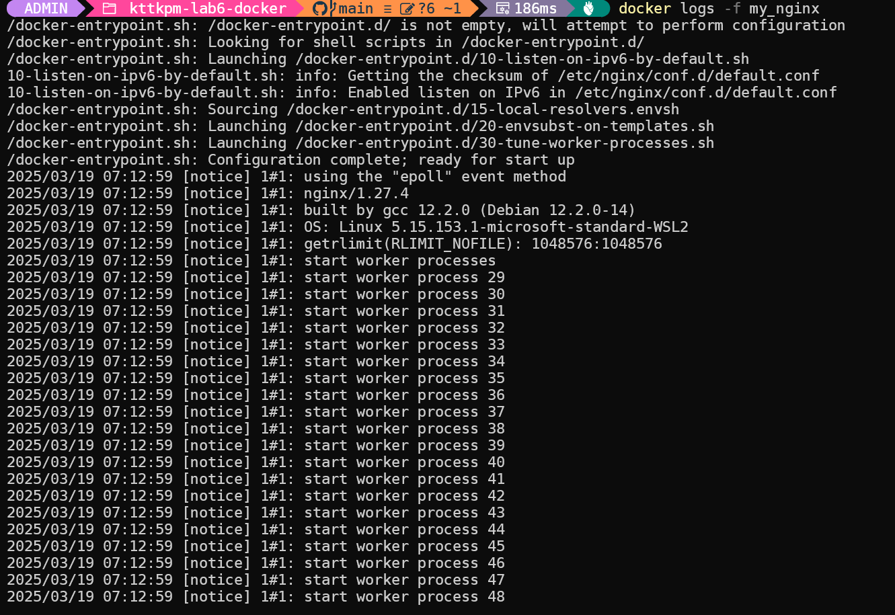
29. create Dockerfile and basic index.html
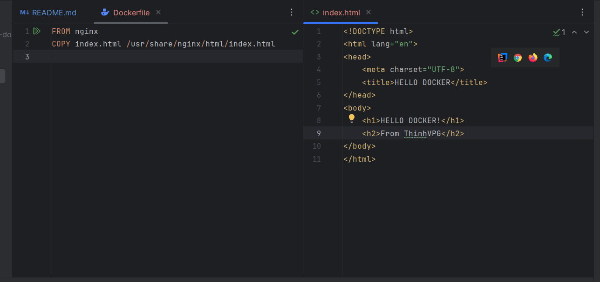
30. `docker build -t my_nginx_image .`: Build file Dockerfile 
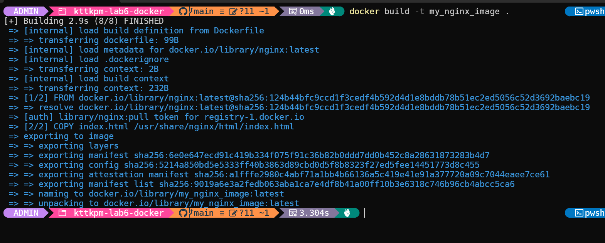
31. `docker run -d -p 8080:80 my_nginx_image`: run con my_nginx_image với port local 8080

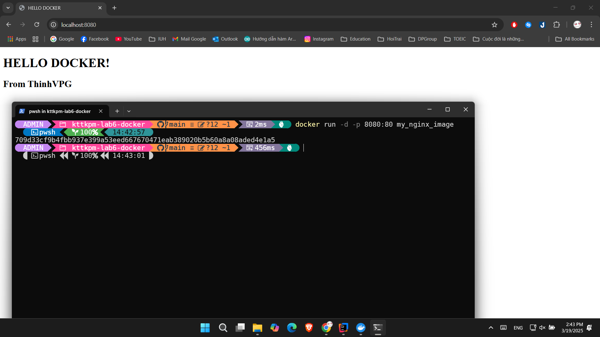

## **PART 2**
1. Tạo Dockerfile chạy một ứng dụng Node.js đơn giản
- Viết file js đơn giản
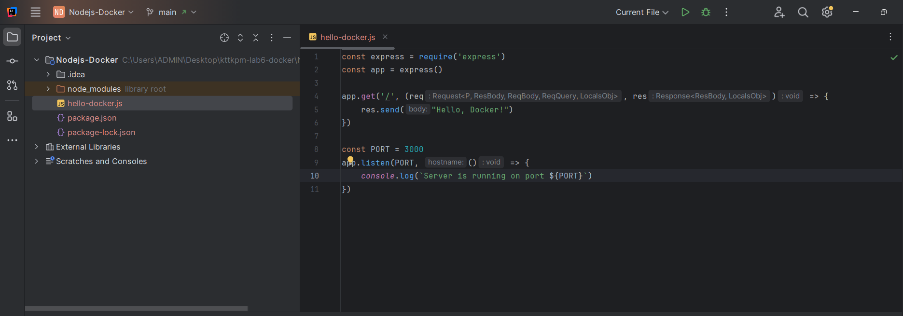
- `npm init -y`: tạo file package.json package-*.json
- `npm i express`: install express
- Viết Dockerfile
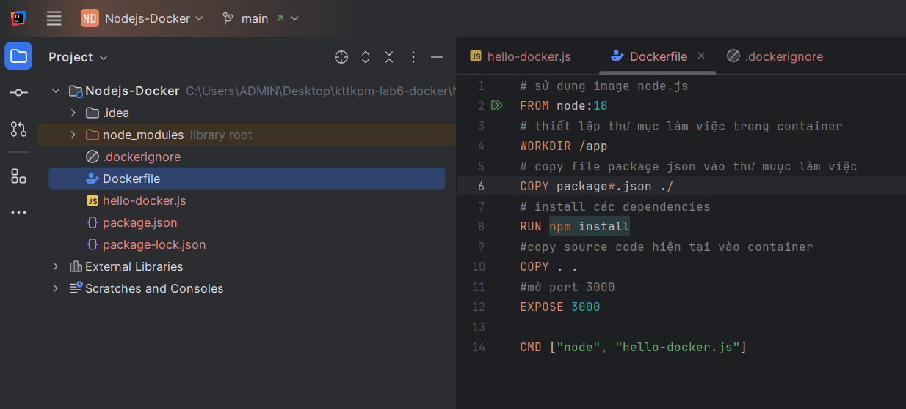
- `docker build -t node-docker-app .`: Build image từ dockerfile 
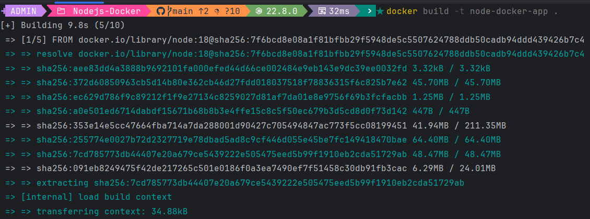
- `docker run -p 3000:3000 node-docker-app`: chạy image voới port 3000
- 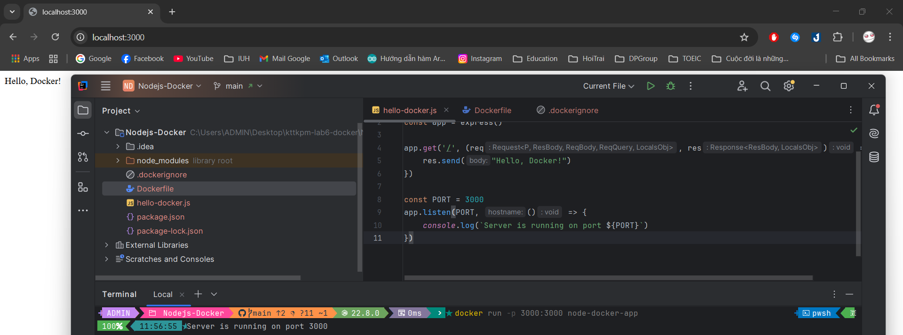